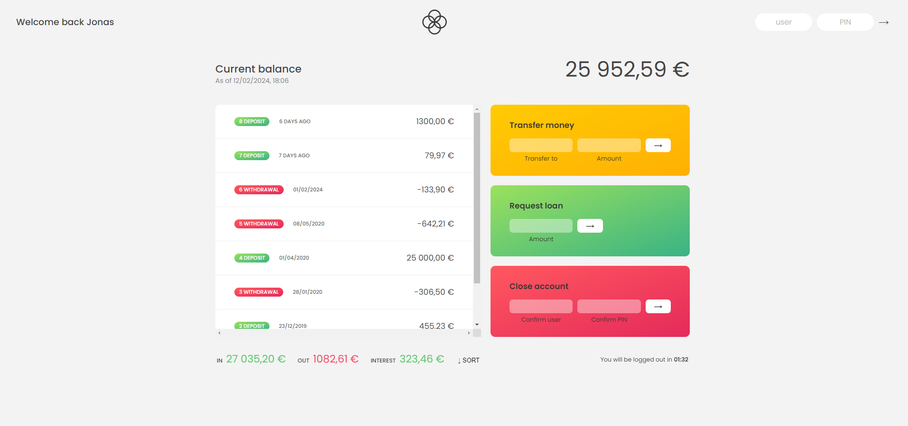

# Bankist App Readme

## Overview

The Bankist App is a simple web application that simulates basic banking functionalities such as viewing account balances, making transfers, requesting loans, and closing accounts. It is built using HTML, CSS, and JavaScript.

## Features

- **Login**: Users can log in to their accounts using their usernames and PIN codes.
- **View Account Information**: After logging in, users can view their account balance, recent transactions, and other account summary information.
- **Make Transfers**: Users can transfer funds to other accounts by specifying the recipient and the amount.
- **Request Loans**: Users can request loans by specifying the desired loan amount.
- **Close Account**: Users can close their accounts by providing their username and PIN code.

## Project Structure

- **index.html**: The main HTML file that defines the structure of the web application.
- **style.css**: The CSS file that contains the styles for the Bankist App.
- **script.js**: The JavaScript file that implements the functionality of the Bankist App.
- **README.md**: This file, which provides an overview of the project.

## Usage

To use the Bankist App, follow these steps:

1. [Open Bankist Dashboard](https://ginjak.github.io/Bankist/)
2. Log in using one of the predefined accounts:
   - Username: `js` | PIN: `1111` (for Jonas Schmedtmann's account)
   - Username: `jd` | PIN: `2222` (for Jessica Davis's account)
3. Once logged in, you can view your account information, make transfers, request loans, and perform other banking operations.

## Credits

The Bankist App project is based on the "Bankist" project from the "The Complete JavaScript Course 2021: From Zero to Expert!" course by Jonas Schmedtmann on Udemy.

## License

This project is licensed under the MIT License. See the LICENSE file for details.
